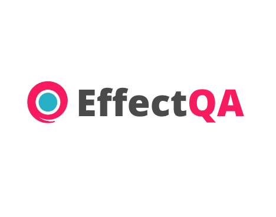
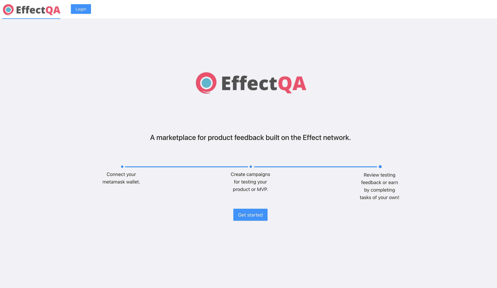

    

## EffectQA

Tokenized product feedback.

#### Region:

- US

#### Team Members:

- **Chris Buonocore**, Full Stack Engineer

Create a QA taskforce for your application using the effect js framework.

Built for the Effect Network - Future of Work hackathon 2022.

## Inspiration

Early on as a startup, it can be hard to collect feedback on your product and get adequate testing. Customers also shouldn't be responsible for doing QA - they expect a completed product.

Existing testing platforms and firms exist, but can reach the thousands of dollars price range quickly even before you start to see value.

With EffectQA, you can gather valuable feedback for your product in days without breaking the bank, and without having to hire part or full time employees.

## Core functionality

EffectQA enables both job creators and job seekers in the technology / product space to connect.

For task creators:

- Create jobs that folks in the Effect community can pick up and complete

For task completers:

- Each Effect token (EFX) as a reward based on successful completion of tasks.

## How we built it

- ReactJS core app base
- EffectJS sdk (creating campaigns and completion).
- Web3 (metamask). Connect wallet for campaign creation and payments.

## What we learned

- How to use effectai / effect token to create custom campaigns and collect task responses.
- Integrate a web3 application with the effect sdk>

## What's next for EffectQA

- Deploy as live website

## Running the project

### Client

From the root folder
`yarn && yarn start`

The website should be running on localhost:3000.

### Server

This project uses a nodejs backend to track created jobs and campaigns. This project uses a temporary (file-based) database but could be adjusted to use a remote database instance.

From the `/server` folder:
`yarn && yarn start`

The backend service should now be running on localhost port 3001.

--

By default, EffectQA requires metamask installed and connected to the BSC (smartchain) testnet.

### Deployment

Used the front end deployment strategy of your choice (AWS, GCP, netlify) to host the project and access it.

    

### Useful links

- Software testing market projected growth: https://www.databridgemarketresearch.com/reports/global-software-testing-services-market
- Example created campaign: https://testnet.effect.network/campaigns/144
- https://testnet.effect.network/
- https://effect-network-hackathon.devpost.com/
- https://github.com/effectai/effect-js/

<!--
# Effect-JS Hackathon Boilerplate 🛵

Boilerplate for the hackathon, including node script and webpage showcasing basic effect-js functionalities.
You can find the corresponding documentation in the `node` and `browser` folders.

# Hackathon
Join the hackathon and get your first effect-js project running!
[Join at DevPost](https://effect-network-hackathon.devpost.com/)

# Demo
A demo of the browser boilerplate can be found at the following link:
[Hackathon Browser BoilerPlate Demo](https://effectai.github.io/hackathon-boilerplate/)

# Quickstart
Take a look at the [quickstart guide](https://developer.effect.network/quickstart/) in order to understand how to install and use the library.
-->
