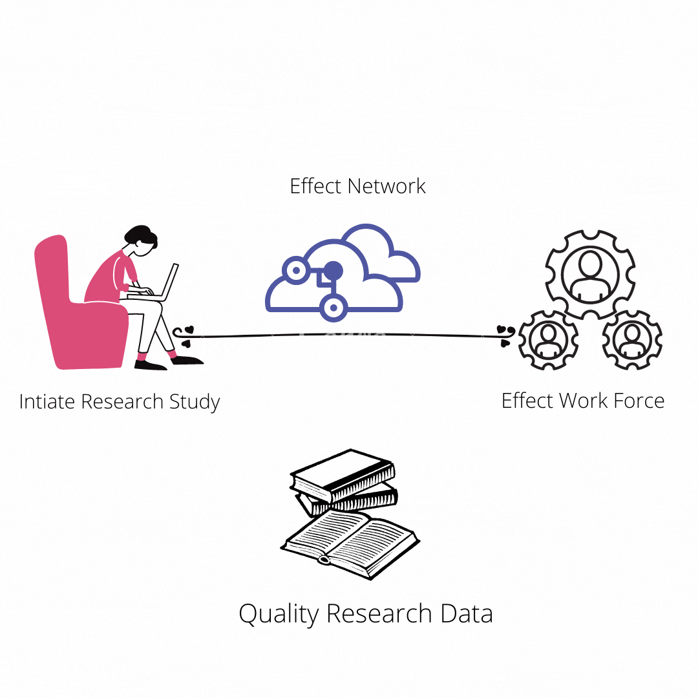
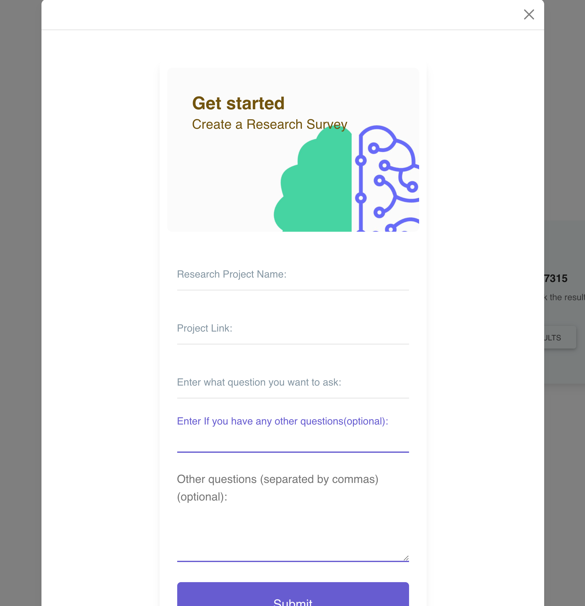
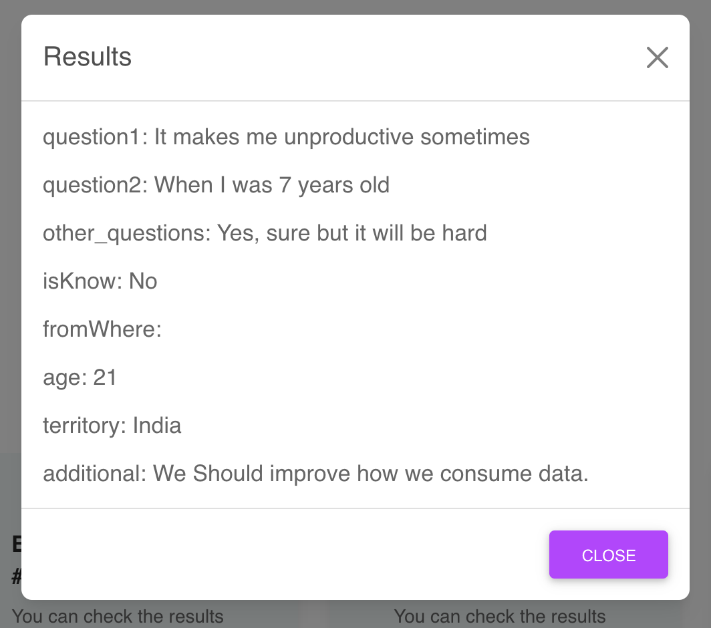

# ⚡ Hackathon Project Template ⚡

_This is a sample submission repository.
Please [**fork this repo**](https://help.github.com/articles/fork-a-repo/) and use this as a starting point for your hackathon project._

## Project Name

Effect Research

### Team name

Mani Sai Prasad

##### Region location

India

##### Team Members

-   Mani Sai Prasad

#### Project Description

### Inspiration

We know that research is necessary for many reasons like building Knowledge, Comprehending New Trends and Understanding Issues. But it is very hard to get the data for a research study. I faced a hard time with my research about Social Media Issues a while ago. It's very difficult to get data and that too getting useful and quality data is the next level. So I built this Effect Research Dapp to help all those people who are doing research to make the world a better place.

A User can create a research study and submit it to the effect network and They will get the data from a global workforce for their research. They can view and download that data.

#### Summary

EffectResearch helps students, scholars and researchers to get quality data for their ongoing research.

#### URLs

#### Presentation

# How it works

# Application Screenshots

## Landing Page

## Dashboard

## Create new Research Study

## Workforce Template

## Results

#### Next Steps

What do you need to do next to turn this prototype into a working solution?

#### License

This repository includes an [unlicensed](http://unlicense.org/) statement though you may want to [choose a different license](https://choosealicense.com/).
