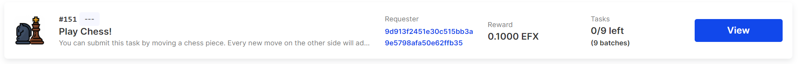
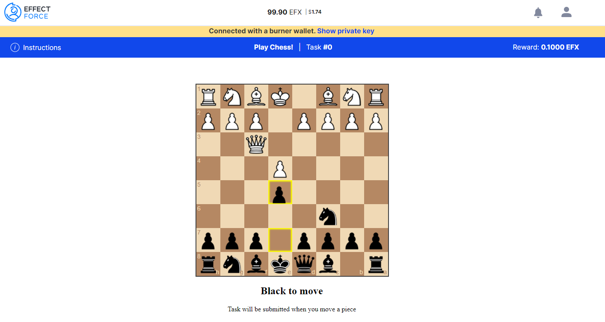

## ChessForce

##### Region location
Netherlands

##### Team Members
- Kevin Laan

#### Project Description
Play chess against workers on Effect Force!

#### Summary
Both sides have a chessboard. You can submit your move by posting a new task and the workers can submit their move by completing that task on Effect Force. Both the task batches and the results contain a [FEN string](https://nl.wikipedia.org/wiki/Forsyth-Edwards_Notation) to describe the chess board positions

#### URLs
- ChessForce Demo: Coming soon!
- Campaign on Effect Force: https://testnet.effect.network/campaigns/151
- Git repository: https://github.com/kevinlaan/hackathon-submission-repo/tree/main/chessforce

#### Presentation

#### Next Steps
- Would like to see multiple repetitions so that you are not playing against one worker, but for example 10 workers (majority decides what move they will make)
- Figure out ways to prevent cheating
- Would be great if workers would get a bonus if they win

#### License
This repository includes an [unlicensed](http://unlicense.org/) statement though you may want to [choose a different license](https://choosealicense.com/).
